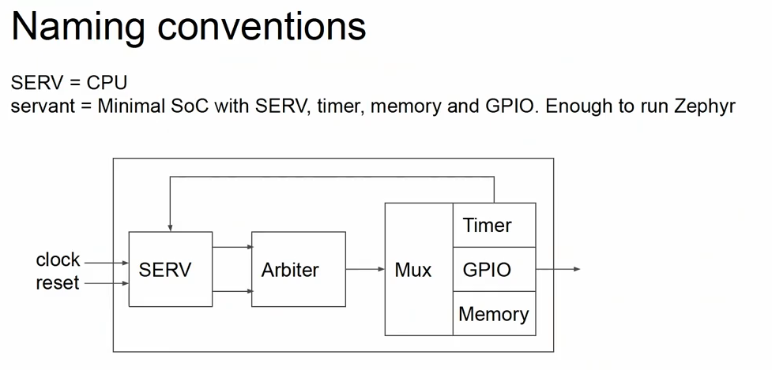
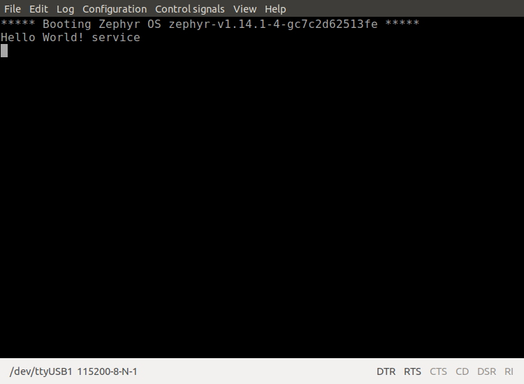
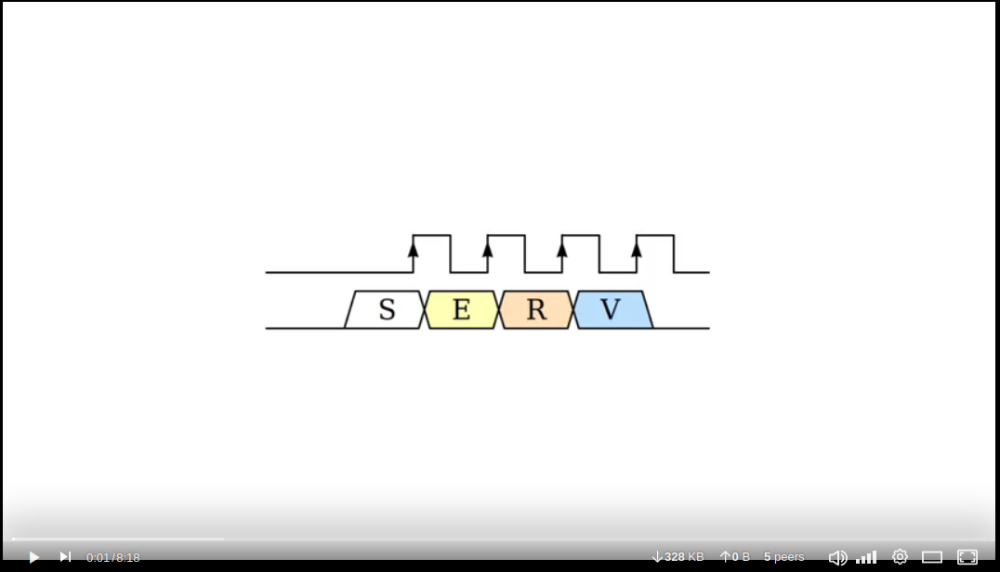
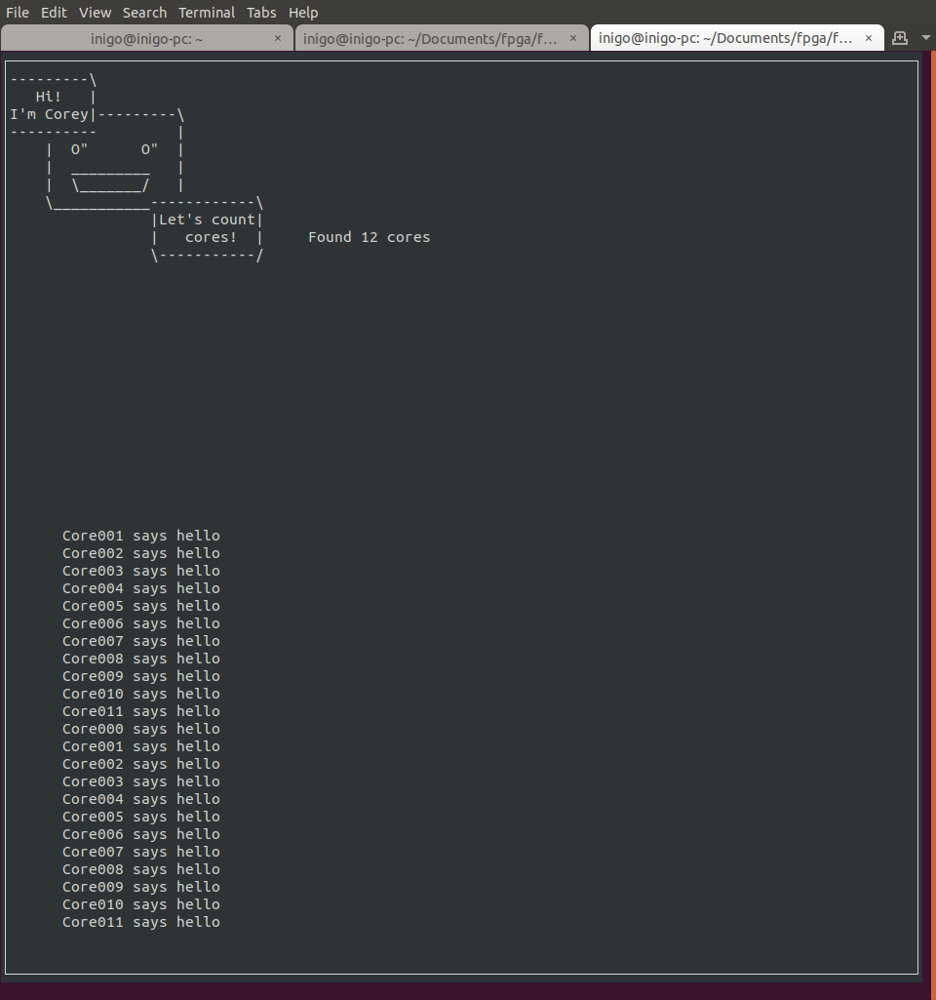

# Running a RISC-V softcore in FPGA

Nowadays there is a very big trend in implementing softcores in FPGAs. This trend has
been boosted by the appearance of [RISC-V](https://riscv.org/). For those who are not familiar, RISC-V is an open-source and free Instruction Set Architecture
([ISA](https://en.wikipedia.org/wiki/Instruction_set_architecture)) based on [RISC architecture](https://en.wikipedia.org/wiki/Reduced_instruction_set_computer). The practical consequence is that you can get freely the ISA of RISC-V, and implemented it in a chip.

Normally, the first step would be to design an architecture based on RISC-V and later, build it in a chip. There are some companies that they design RISC-V cores, and sell the license to chip manufacturers.

[In this page](https://www.sifive.com/risc-v-core-ip#standard-core-grid), you can find RISC-V based IP Cores that SiFive offers, the most known company in this field.

I have heard some times that RISC-V is the open-source hardware of
computer architectures, honestly, I wouldn't say so. It is true that you
don't need to pay for the usage of RISC-V ISA. But, at the end of the day, you need
to get a chip with that architecture, and the architecture implementations is not open,
in other words, silicon makers, do not disclose **how** the implement the computer
architecture in silicon.

From the other hand, there are many truly open-source RISC-V implementations (softcores),
made for FPGAs. Additionally, they are synthesized using open-source tools. So, **from the
ISA implementation to the bitstream creation is made in open manner!**

__________

:warning: *I am not a RISC-V expert, if anything stated here is not right, let me know* :warning:

__________


Now, I am going to present a couple of examples of RISC-V running in my Alhambra II board.

There are several RISC-V implementations using open-source tools out there. One of the most popular one is the
[PicoRV32](https://github.com/cliffordwolf/picorv32). This repo allows you to synthesize a RISC-V RVM32IC Instruction Set
and flash it in your FGPA, using open-source tools. In this case, it is truly an open-source effort from beginning to
the end, as the license of PicoRV32 is ISC license (similar to MIT license or the 2-clause BSD license). Later, you can use
RISC-V toolchain to load your binaries to your softcore!

### Serv and Servant

In my case, I stumbled upon another implementation. [Olof Kindgren's](https://twitter.com/OlofKindgren) [serv](https://github.com/olofk/serv).
Serv is an 32-bit serial RISC-V CPU. It uses Fusesoc as package manager and building tool, some clarifications about this later. Serv
is the CPU itself, once you add a timer, some memory and GPIOs you obtain a SoC enough
to run complex programs. This SoC is called `servant`, below a diagram about its composition:


*Taken from RISC-V talk, linked below*

This SoC has enough capabilities to run Zephyr RTOS. And actually, the example runs it!

As the core has support for different Lattice iCE40 boards, I ported it for the
 Alhambra II board. Thanks to the use of _Fusesoc_, Verilog coding was not necessary,
I just added new entries in the [.core](https://github.com/olofk/serv/blob/master/servant.core#L142) file regarding the board.

The example runs Zephyr RTOS and prints a `hello world` example. If you think about it, is pretty neat, you have a RISC-V softcore
that is able to run Zephyr that executes a program that prints `hello world` message:



Olof aims to extend the functionality of the core, to make it more useful. For instance, adding a `c` extension to it would allow coding c programs and
compile it using RISC-V tool-chain.

I have pasted below the usage of the resources of the `servant`, as you can see, it doesn't take much logic cells in a low-end FPGA:

```
Info: Device utilisation:
Info: 	         ICESTORM_LC:   610/ 7680     7%
Info: 	        ICESTORM_RAM:    17/   32    53%
Info: 	               SB_IO:     2/  256     0%
Info: 	               SB_GB:     6/    8    75%
Info: 	        ICESTORM_PLL:     1/    2    50%
Info: 	         SB_WARMBOOT:     0/    1     0%
```

If you are interested about the details of Serv/Servant, see the vide below:

[](https://diode.zone/videos/watch/0230a518-e207-4cf6-b5e2-69cc09411013)

### CoreScore

Olof also created CoreScore, it allows you to test how many `serv` cores you can fit in your FPGA. So, in this case, you can implement a multi-core RISC-V SoC in your FPGA :)

In the case of the Alhambra II, I was able to fit 12 `serv` cores in total:



As the design works at 16MHz, and the board contains a 12MHz oscillator, I used one of the PLLs of the iCE40 to crate those 16MHz out of 12MHz. Below the resource utilization
of the design:

```
Info: Device utilisation:
Info: 	         ICESTORM_LC:  5969/ 7680    77%
Info: 	        ICESTORM_RAM:    15/   32    46%
Info: 	               SB_IO:     3/  256     1%
Info: 	               SB_GB:     6/    8    75%
Info: 	        ICESTORM_PLL:     1/    2    50%
Info: 	         SB_WARMBOOT:     0/    1     0%
```

### Fusesoc

[Fusesoc](https://fusesoc.readthedocs.io/en/master/) is a HDL package manager and a build system for digital hardware designs. When you start
working in a project that requires the use of several modules, it is convenient to have a tool that allows you to manage everything. Additionally, the reuse of designs is something crucial for speeding up
new designs, this is where Fuesoc can shine.

I profited my time to port also the Fusesoc `blinky` example to the Alhambra II board, so it is part of this project too. To make it work,
it just required to add the [pinout file](https://github.com/fusesoc/blinky/blob/master/blinky.core#L5) and the [board synth parameters](https://github.com/fusesoc/blinky/blob/master/blinky.core#L155).

### Conclusion

I think this post shows how digital hardware design field is a very buzzing
field. To make this post, I have used several open-source items: RISC-V softcores, Zephyr, Fusesoc, Serv and Servant or CoresCore. I really hope
that this new trend changes the landscape of digital design tools, where
proprietary and black boxed-tools have been the rule, dominated by just a couple of very big FPGA vendors. In addition, it also opens the door of fusing this technology with others that are really consolidated, like Linux.
I am really looking forward to see heterogeneous embedded systems where all these tools are blended together to squeeze the best of each!

### Resources

About RISC-V

- [RISC-V: Is it Open Source Hardware? ](https://www.youtube.com/watch?v=4qBKOAv0sBI)

About Serv

- [Bit by bit - How to fit 8 RISC V cores in a $38 FPGA board talk](https://www.youtube.com/watch?v=xjIxORBRaeQ) by Olof Kindgren

- [Diode Zone Serv video](https://diode.zone/videos/watch/0230a518-e207-4cf6-b5e2-69cc09411013) by Olof Kindgren

Repositories

- [Serv and Servant](https://github.com/olofk/serv)
- [CoreScore](https://github.com/olofk/corescore)
- [Fusesoc Blinky](https://github.com/fusesoc/blinky)
