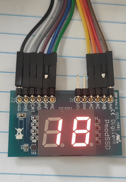
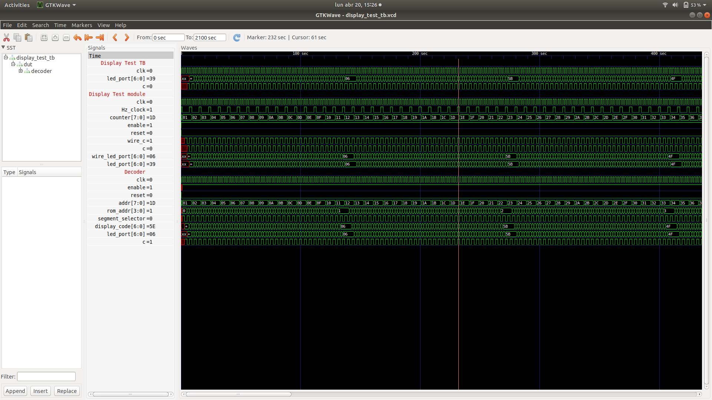

# Implementing a two seven-segment display counter in Alhambra II

In my previous entry, I explained that I have acquired an Alhambra II board for implementing designs using open-source tools.

During this time, I have been refreshing again some concepts of digital design and how to implement them in real hardware. One of the most valuable examples has been the [Verilog tutorial series](https://github.com/Obijuan/open-fpga-verilog-tutorial/wiki) that Obijuan created some years ago. This tutorial makes use of Icestorm and arachne P&R tools to implement different designs in an Icestick board. At the time it was written, the SymbiFlow project it was not born yet.

I have found this tutorials very useful because it shows the digital design-flow using the open-source tools I want to use. As the tutorials were written for the Icestick board, I have profited the time to change the source-code and now, it can be used in the Alhambra II board (you can find the folder [here](https://github.com/Obijuan/open-fpga-verilog-tutorial/tree/master/tutorial/Alhambra_II), already integrated in master, thanks @Obijuan).

The changes I have made are minimal: I changed the pins of each example to adapt it to the board and I also have changed the synthetization commands, to adapt it to the package and flash memory that the Alhambra contains.

After spending some time reviewing the tutorials, I feel pleased not needing to install a specific IDE for my computer, I just added a Verilog language plugin to Atom and install the tool-chain, and I was ready to start! This is one of the things I dislike the most of working in embedded, i very common to see that each manufacturer offers an integrated IDE with the tools, and the developer ends up installing different IDEs depending the target.

Once I finished with the tutorials, I have made my first example: a counter that display its value in an two seven-segment display. This example reminds me to my uni times where the Digital Electronics teacher showed us how to use buttons, LEDs, displays or knots in microcontrollers and FPGAs. I guess is always a good idea to start from such examples to refresh your brain again.

This example make use of different modules. Each of the module is instantiated by another module, that wraps it and adds new functionality. This helps to reduce the complexity of the overall design.

The most basic module is called `clk_divider`. The aim of it is to create a slower period clock, taking 12 MHz clock of the board as source. The duty-cycle of the clock is of the 50%. This is a useful feature, as the 7 seven-segment display uses a cathode-common pin to turn on each of the segment. As the logic of turning on each segment is inverse, when one is turned on with a '1' the other segment turns off the display, so this signal is used to control which display to activate.

In order to store the codes of the seven segment display, I have used a ROM module. This ROM reads a list where the user can store some data. In my case, I have placed there the codes of output pins to generate 0 to F characters. The 7 segment display it uses 7 pins to turn on and off each LED and they are arranged like this:


The ROM list I am using looks like this:

```
// 7 Segment display LED codes
// each position has coded the LED status, coded like GFEDCBA
3F   //-- Character 0 =>  0111111 => 3F
06   //-- Character 1 =>  0000110 => 06
5B   //-- Character 2 =>  1011011 => 5B
4F   //-- Character 3 =>  1001111 => 4F
66   //-- Character 4 =>  1100110 => 66
6D   //-- Character 5 =>  1101101 => 6D
7D   //-- Character 6 =>  1111101 => 7D
07   //-- Character 7 =>  0000111 => 07
7F   //-- Character 8 =>  1111111 => 7F
6F   //-- Character 9 =>  1101111 => 6F
77   //-- Character A =>  1110111 => 77
7C   //-- Character B =>  1111100 => 7C
39   //-- Character C =>  0111001 => 39
5E   //-- Character D =>  1011110 => 5E
79   //-- Character E =>  1111001 => 79
71   //-- Character F =>  1110001 => 71
```
As you can see, it stores hexadecimal values of the state of each pin, generating the 0 to F characters.

The idea behind is that the address of the module contains the same number in for generating it in the seven segment display, so, the module will return the display code of the address set in its input.

The `clk_divider` and `genrom` modules are instantiated by the `seven_segment_decoder`. The aim of this module is to retrieve a toggling signal to turn on each display and to obtain the code of each number. Finally, the `display_test` module instantiates the previous one and makes use of a counter that is incremented each second that will be displayed. Here, the physical pins of the FPGA (defined in the pcf file) are assigned to the designed circuit.

Once finished, I have used the Yosys and NextPnR to synthetize the design into a loadable bistream.

Here a GIF of how it works in the real board (and [here](https://youtu.be/Byp1JDIegp4) you can see a demo video):




Finally, I want to add that, in order to validate the functionality of the modules, different test benches has been used. This is an important step in the digital design flow, as allows to see how the implemented designs work. This saves debugging time to the developer and can also avoid fatal errors, such as the damage of the hardware in boards. For visualizing the simulation, GTKWave has been used. Here a view of the `display_test` simulation:



I hope that I can show you more things in a near future! Thanks for spending your time reading this post, I hope you have enjoyed it or learned something interesting :)

## Links

+ [FPWAwars](http://fpgawars.github.io/)
+ [Verilog tutorial](https://github.com/Obijuan/open-fpga-verilog-tutorial/wiki)
+ [Display example](https://github.com/imuguruza/alhambra_II_test/tree/master/7_segment_display/src)
