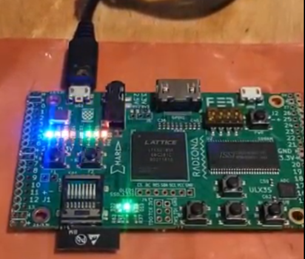
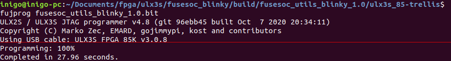
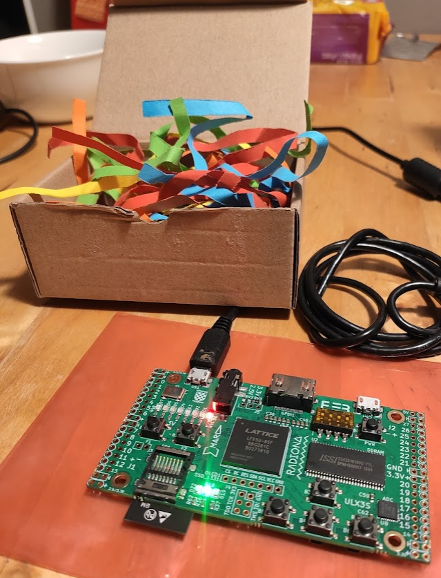
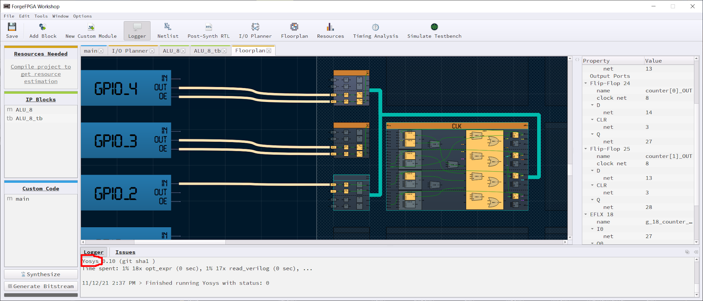

# ULX3S Development board: getting started 

Now that winter is coming again back, I am trying to order the projects I would like to develop in the following months. Is always hard to find time to tinker and write this blog entries, but, at the same time, it is really satisfying.

I would like to continue exploring new ideas using FPGAs and, at some point, I would like to design a board using KiCAD. I also feel tempted to get a development board such as the Ultra96v2 or the new Kria SoM to play with ROS2 and hardware acceleration, which I think is one of the coolest thing to do out there. But, as the chip and component shortage is really bad and I still have plenty of material to keep tinkering, I will save money for now.

It's been a while since I purchased a Radiona [ULX3S](https://radiona.org/ulx3s/) board and still haven't used it. So this blog entry shows the first steps I have made with this board.
There are several reasons why I purchased it:

- It contains an ECP5 Lattice FPGA, much more powerful that iCE40 family. (Check the comparison I [did](fpga-boards))
- It contains an ESP32 with bluetooth connectivity. That means Ii is possible to build a mobile robot and control it through the laptop.
- I can synthesize RISC-V cores, so I can start exploring hybrid computing architectures.
- It has been designed in KiCAD.
- It's open source.
- It has many exposed GPIOs and interfaces
- And, last but not least, the design is really neat and small.

You can see some characteristic of the board in the next image:

## Updating the toolchain

As it has been a while since I lastly used FuseSoC, Yosys and Nextpnr, the first step has been to update all the tool-chain. In addition I had to install the `nextpnr` specific for ECP5, supported by Project Trellis, as the target is not the same as the Alhambra board I have used till now.

For updating Yosys, I just have updated from `apt`: `$ sudo apt-get install yosys`. Now, I had to install the tools from [Project Trellis](https://github.com/YosysHQ/prjtrellis). Follow the instructions and don't forget to clone the repo using `--recursive` option, otherwise, you will not get the required database compiled.

Then, you need to get the `nextpnr` place and route compiled with the Trellis tools you did before. You can find the instructions [here](https://github.com/YosysHQ/nextpnr#nextpnr-ecp5).

Last but not least, for downloading the bitstream to the board, I have installed `fujprog`. You can go to its [GitHub page](https://github.com/kost/fujprog/releases) and download the precompiled binary and place it under `/usr/bin`

## Loading the precompiled Blinky

For this first example, we will just download a precompiled bitstream to the board. To do so:

- `$ git clone https://github.com/ulx3s/blink.git`
- `$ cd blink`
Connect the board to the PC using the port US1 and execute the next command:
- `fujprog blink_85f.bif`

Now you should see that the LEDS start blinking, doing a binary counter pattern, something like this:

## FuseSoC LED to believe

Now that we have upload a precompiled example, let's flash FuseSoC's "LED to believe" example. A while a go, I ported this example to the Alhambra II board, but this time, this example is already supported.
Before flashing, I have updated FuseSoC, to fetch the latest libraries: `$ fusesoc library update`.

Then compile the blinky example: `$ fusesoc run --target=ulx3s_85 fusesoc:utils:blinky`.

Last, you can use `fujprog` to upload the bitstream. For doing so, go to be build folder and upload the bitstream:

`$ cd build/fusesoc_utils_blinky_1.0/ulx3s_85-trellis`

and

`$ fujprog fusesoc_utils_blinky_1.0.bit`. Now you should see something like:

And a red light should be blinking!

## Next Steps

Now that I got my hands dirty again, one of the following steps I want to do is to understand the hardware design of the board, so I will print the schematics and review how everything is connected. Afterwards, I might refresh the use of FuseSoC and Verilog, making some simple examples using LEDs and buttons.

## Fresh News: Renesas ForgeFPGA

I just wanted to add that [Renesas has announced](https://www.renesas.com/eu/en/about/press-room/renesas-enters-fpga-market-first-ultra-low-power-low-cost-family-addressing-low-density-high-volume) that they will start selling small FPGAs, this FPGA family has been named as ForgeFPGA. They have shared that it is designed for low cost, ultra-low-power and low density (<2K LUTs) applications. It is good to see that new players enter into the market. But what I found more satisfying is to see that their **design tool is based in Yosys**:

Is it another sign of change in FPGA toolchain paradigm towards open-source? I hope so!
