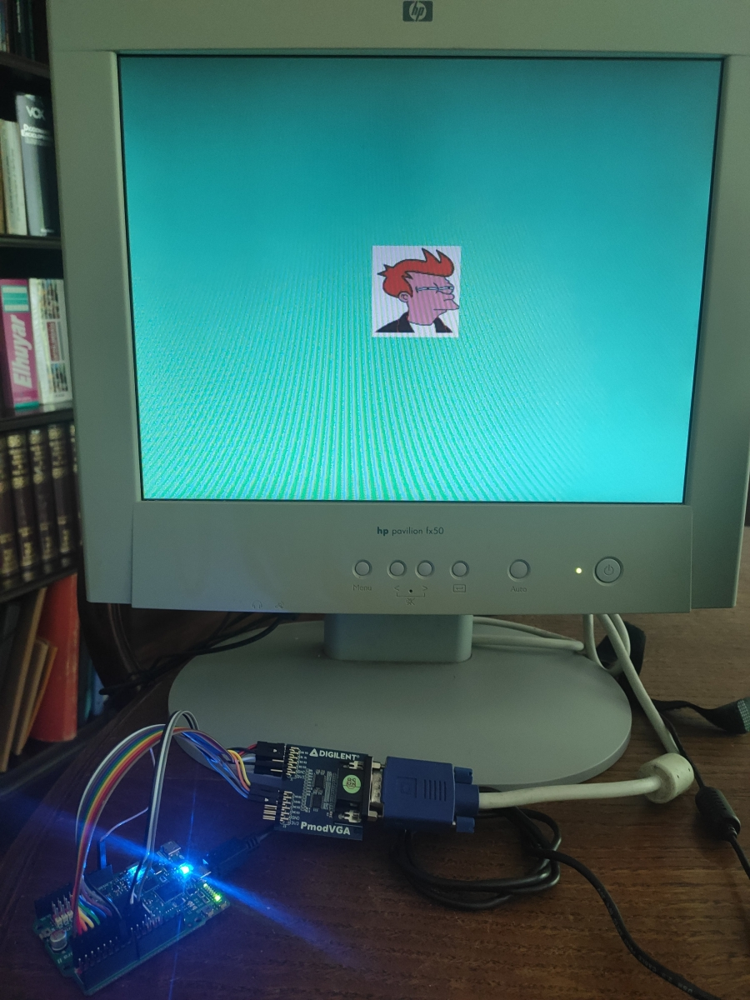

# Driving a display using VGA

I have seen lately some cool arcade emulators based on FPGAs. This gave me the idea of checking how VGA works, I thought it could be
cool to generate some images using my Alhambra II board.

The origins of the VGA standard are back from when analog displays where used. First, cathode ray
tubes where used for creating images. These cathode ray tubes shoots electrons all over the display, row by row, and once arrives to the end, goes back to the beginning. We normally
refer to this frequency as _refresh rate_ of a display (45 or 60 Hz for example).

There are two important group of signals to drive a display using VGA. One of those is the RGB color of the pixels we want to draw. These are an
analog value, one pear each color.


*Image taken from stackoverflow*

And the second group are sync signals, an horizontal (`hsync`) and a vertical (`vsync`) synchronization signal. These two signals are used to tell
the display when an horizontal line ends up and the entire display has been refreshed, starting the cycle again.


The timing of those signals depends of the amount of pixels we want to reproduce in the display and the refreshing rate. But both, horizontal
and vertical sync signals, are composed by a time frame for displaying the pixels, a back porch and front porch and a sync signal generation time.
These last signals were used to give time to the cathode ray tubes to place back to the beginning.

The next shows how those signals work:


*Image taken from Digikey*

As I want to use 640x480 resolution @ 60Hz, checking the timing in the [VGA standard](http://caxapa.ru/thumbs/361638/DMTv1r11.pdf) or the _table A1_ in [this page](https://www.digikey.com/eewiki/pages/viewpage.action?pageId=15925278), we can see that the timing of the sync signals needs to be the next:

- Pixel clock of 25.175 MHz

- Horizontal
  - Display 640 pixel clock ticks
  - Front Porch 16 pixel clock ticks
  - Sync Pulse 96 pixel clock ticks
  - Back Porch 48 pixel clock ticks

- Vertical
  - Display 480 pixel clock ticks
  - Front Porch 10 pixel clock ticks
  - Sync Pulse 26 pixel clock ticks
  - Back Porch 33 pixel clock ticks

One important detail to notice is that the `hsync` and `vsync` are logic high and asserted to low to create the sync signal. One of the things confused me
at the beginning was at which point vertical sync signal needs to be created. This signals holds high until the `hsync` has gone through all the 480 rows until
`vsync` creates the front porch, sync pulse and back porch. The standard also defines the clock frequency to create each pixel, that is of 25.175MHz.
This value is not strict, for instance, modern display accept 25MHz.

As the Alhambra board does not have any VGA port, I bought a [VGA Pmod](https://store.digilentinc.com/pmod-vga-video-graphics-array/). The breakout uses a resistor
ladder and a DAC to create the analog signals for the RGB color. Each color has three input pins, so, in total you can use 9 bits to define the color you want to display, plenty of them.

As first I wanted to be sure that the hardware was working, I synthesized an example created by Obijuan of FPGAwars. For that I used [icestudio](https://icestudio.io/), a graphical interface to design and program the board. I just changed the output pins and worked!


### Creating a simple test palette

Once I was sure I could make it work, I designed the Verilog `vga sync` [module](https://github.com/imuguruza/alhambra_II_test/blob/master/vga/vga_test/vga_sync.v). The goal of this module is to create the sync signals. As the Alhambra board has a 12 MHz oscillator,
and the pixel clock I require was of 25.175 MHz, I needed to use one of the PLL the FPGA contains. The good thing is that Yosys supports it and it is straight forward to
instantiate it. This PLL allows to create the desired pixel clock out of the oscillator. If you want to understand how PLL works, I recommend you reading [this wiki](https://github.com/mystorm-org/BlackIce-II/wiki/PLLs), it explain how the iCE40 PLL works and its parameters.

Yosys has a helpful tool to know the value of the parameters PLL needs to be instantiated, `icepll`. I used it to check which values I needed to input to create the pixel clock:

```bash
$ icepll -i 12 -o 25.175

F_PLLIN:    12.000 MHz (given)
F_PLLOUT:   25.175 MHz (requested)
F_PLLOUT:   25.125 MHz (achieved)

FEEDBACK: SIMPLE
F_PFD:   12.000 MHz
F_VCO:  804.000 MHz

DIVR:  0 (4'b0000)
DIVF: 66 (7'b1000010)
DIVQ:  5 (3'b101)

FILTER_RANGE: 1 (3'b001)
```

So, as we can see, the clock value I obtained from the PLL is about 25.125 MHz, it is not of 25.175MHz but it is more than enough for driving the display.

The module contains two counters, a counter for horizontal pixels and another for vertical pixels. The vertical counter increases once the horizontal has arrived
to the end of a row. Once the vertical is in the last line, it creates the back porch, sync signal and front porch signal, following the timing of the standard.
Same with horizontal, once arrives is out of the pixel displaying, values it creates the corresponding back porch, sync and front porch signals.

This module is wrapped in a [test module](https://github.com/imuguruza/alhambra_II_test/blob/master/vga/vga_test/vga_sync_test.v). This module instantiates the `vga sync` module and uses its horizontal and vertical counters to create RGB values when the counters
are in the display area. The test pattern shown are four squares, generating red, blue and green colors. At fourth square, all the outs are set to '1', creating a
white square.


The next capture shows how Yosys make use of one of the iCE40 PLLs when design synthesization is made:


### Creating an image

Once I saw that the VGA signals I was creating were OK, I went for displaying a picture. I wanted to load the image out of the BRAM of the FPGA, instead of creating a pattern as I did
with the test palette. The idea was to store the code of each pixel in the RAM. But first, I needed to check the amount of RAM the board contains. Checking the datasheet,
I could see that the FPGA embeds 80Kbits of RAM split in 4K blocks. If you make some maths, it is not much. If I wanted to display a whole 640x480 image using the 3 bits per RGB color I used in the previous example that required:

`640 horizontal pixels/line x (3 bits/color * 3 color) * 480 vertical row = 2764800 bits = 2700 Kbits`

2700 Kbits, much more that what I have! So I couldn't generate such a big image using that many colors... In addition, I needed to think about how I would fit the pixel color data in the RAM. Checking again the datasheet, there are four possible RAM configurations:


In order to optimize the use of memory, it would make sense to try to fit RGB color somehow in one of the four RAM configurations, not wasting bits. Playing a bit with RAM size, RGB bits and image sizes, I decided to use 8 bits of RGB color (one would be unused) and a 100x100 size image. That would make, 100x100x8 = 8000 bits = 7,8125 Kbits of RAM usage. This means
that all of the 80Kb of RAM would be used in the design, having the last addresses empty. As the RGB color bits set are 8, I decided to use 512x8 RAM configuration, storing one pixel RGB value in each address. This
is handy, I don't need to make any bit shifting or processing.

For using the RAM, I have created a `ram` module, that allows to read and write. It loads a file, defined by `RAMFILE` parameter using `$readmemh` function at the beginning. This
implies that the image will be stored in the design and loaded in boot time, so it is not possible to load different images.

The [top module](https://github.com/imuguruza/alhambra_II_test/blob/master/vga/vga_image/vga_image.v) instantiates the previous `vga sync` module, to create the `hsync` and `vsync` signals, as well as the horizontal and vertical counters, that allows to know which pixel
we need to draw. This module also instantiates the `ram` module, passing the data width and address width and the image we want to load, creating an appropriate RAM configuration and
loading the image in the RAM.

Finally, using the aforementioned counters, I have added the logic to create, in the middle of the display, the stored image. The rest of the display will be fill out with a color. This could
improved, for example creating two-color small boxes or any other pattern.

The next capture shows how Yosys takes the BRAM of the iCE40 for storing the image:


The final stage is to create the image file. As we have seen, this image file needs to contain in each row one pixel, that is coded using 8 bits. I searched jpg to hex online converters, and found [this one](https://www.digole.com/tools/PicturetoC_Hex_converter.php). As you can see in the image below, it provides as output a list of colors, separated by commas.


I selected the 256 color coding, that uses RRRGGGBB color format. As the neglected bit is one of the Red color pins, I adapted the pin out to do so, not using the R0 pin.

Finally I saved that color string. In order to obtain a list of one pixel colors, I used first `tr -s , '\n' < string.file` command. This command searches for commas and convert them
into line breaks. This allowed me to have each pixel color in separated lines. Finally, using a test editor, I erased all the `0x` that appeared in each line ( I couldn't do it using
`tr`, it was erasing all the 0s, deleting all of them in many lines). Using this procedure, I have created Futurama's [Bender](https://github.com/imuguruza/alhambra_II_test/blob/master/vga/vga_image/bender.mem) and [Fry](https://github.com/imuguruza/alhambra_II_test/blob/master/vga/vga_image/fry.mem) image lists.

You can see the result below, cool right? :D




### Next steps

It is pretty annoying to change the image file at the top module and re-synthesize each time you want to display a new image.
So, I would like to add a serial communication with a buffer. This would allow to send a new image file and stored it in the RAM. Probably, this would need an additional
RAM block, attached to the serial interface. Once the image is sent, this new image would be loaded in the VGA module RAM, changing the displayed pattern. This implies the need of two separate RAM blocks, diminishing the size of the displayed image, as I have used almost the 100% of the RAM the board contains.

This also implies having two clock domains, one for the serial communication and one for creating VGA signals.

I would like to add this functionality to the design, let's see if I can put some time to develop it.

### Resources

A list of useful links:

+ [My code repo folder](https://github.com/imuguruza/alhambra_II_test/tree/master/vga/)
+ [Digikey page about VGA](https://www.digikey.com/eewiki/pages/viewpage.action?pageId=15925278)
+ [https://embeddedthoughts.com/2016/07/29/driving-a-vga-monitor-using-an-fpga/](https://embeddedthoughts.com/2016/07/29/driving-a-vga-monitor-using-an-fpga/)
+ [VGA standard specs](http://caxapa.ru/thumbs/361638/DMTv1r11.pdf)
+ [VGA Pmod](https://store.digilentinc.com/pmod-vga-video-graphics-array/)
+ [Info about iCE40 PLL](https://github.com/mystorm-org/BlackIce-II/wiki/PLLs)
