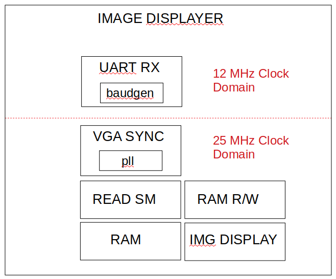
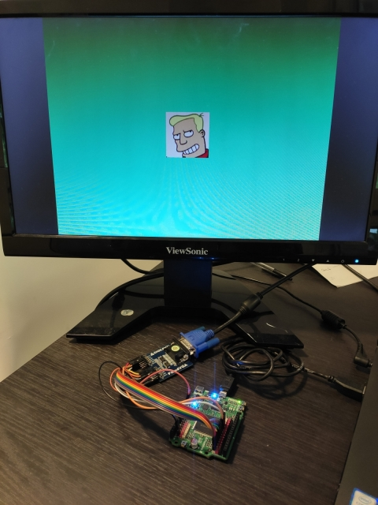
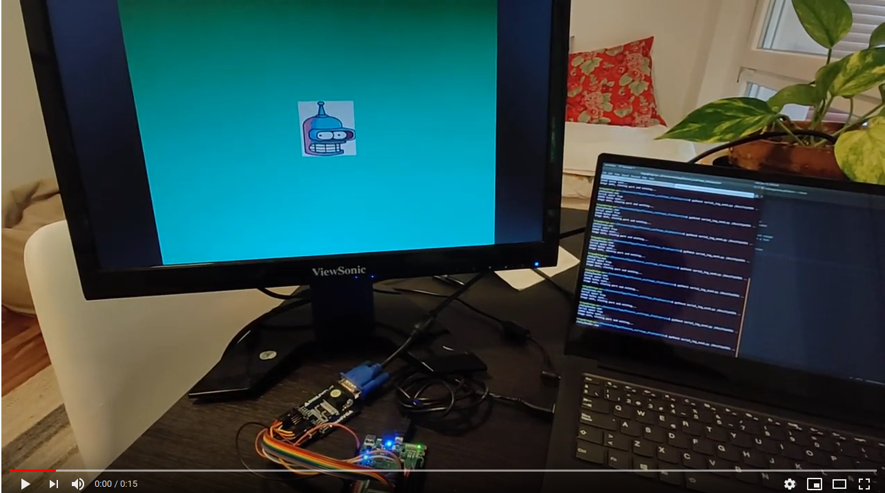

# Driving a display using VGA II

This time, I have come back to the previous work I did with VGA.
As I mentioned in my [previous post](vga.md), I wanted to upgrade the design to
be more useful.

So, I have added image receiving functionality. This allows to send hexadecimal
image files to the board using serial communication. Once the the file is send,
the new image is displayed. Let's see what I have added to the previous design and
discuss some technical details.

The first addition is a serial communication read module. This module reads the
`rx` line and provides the received 8-bit data at its output, using a `data ready`
signal pulse to signal that new data has arrived. I have reused the FPGAwars [uart-rx](https://github.com/Obijuan/open-fpga-verilog-tutorial/wiki/Cap%C3%ADtulo-25%3A-Unidad-de-recepci%C3%B3n-serie-as%C3%ADncrona)
for that purpose.

This module contains a state machine that waits till `rx` goes low, and stores the
received bits. You can configure the baud rate of the communications, to fit your
needs.

Thanks to this module, the FPGA will be able to read the new image file sent from
the computer, but still we need to store the image in RAM and display it. For such
a purpose, I have decided to create small state machine that controls if the FPGA
reads the serial or displays the image.

The reason I have decided to do it like this is simple. As the embedded RAM in the
iCE40H4XK allows me to create an 8-bit 100x100 pixel image, I have decided to keep
it. I could add a FIFO or split the RAM to store the received image first, and load
it to the RAM that stores the image, but this would mean to sacrifice the size (or
the color palette) of the image, as the RAM needs to be distributed.

As the RAM allows to read and write operations, I decided to use this capability.
So this requires to control when the image is being read and write from the RAM.
To control it, I decided to use a two-state state machine. This allows to
avoid simultaneous read and writes from the RAM.

By default, the state machine is in display mode, reading the stored image in the
RAM and displaying it through VGA. Once the `rx` generates the start bit, the state
changes to write mode. In this state, the `uart rx` is in charge to provide the new
data. This new data is stored in the RAM, using the `data ready` pulse to detect
when a new chunk has arrived. This state changes the command of the RAM, putting
into write mode. As a new image is being sent, the image generator does not read
from RAM, and creates a light blue color in the screen.

Once the new image is received, the state machine goes back to display mode,
putting the RAM into read mode and creating the image.

## Practicing crossing domain clock

The default clock of the design is of 25MHz. This is created by the PLL of the
board I am using. This is required to meet the VGA timings. But the serial
communication does not need such a fast clock.

As I have been reading about crossing domain clock, I decided to put it in practice.
Before talking about this topic, I want to explain a bit how which are the design's clock
domains. If we divide it into functional blocks, it would look like the
next diagram:



The UART RX module uses the board's 12MHz clock and the rest of the design works under
25MHz. This implies that some signals in the design work at different speed and
this needs to be treated carefully.

The `data ready` is under 12MHz domain and it is read by the part that is responsible
of writing the new data in RAM, which works at 25MHz. To avoid metastability,
the signal `data ready` is flopped by some flip-flops, like this:

```
always @(posedge clk_sys) begin
	data_rdy_rx       <= data_rdy;
	data_rdy_ram_prev <= data_rdy_rx;
  data_rdy_ram      <= data_rdy_ram_prev;
  data_rdy_new      <= data_rdy_ram;
```

As we can see, this `always` block is executed each time `clk_sys` positive edge
occurs. This clock is the 25MHz clock. This registers also allows to check a
positive edge of the signal later in the design:

```
if (data_rdy_new == 1 && data_rdy_ram == 0 ) //Posedge happened, new data
```

This way, any conflict that could arise is avoided. In addition, as the serial
read line could change asynchronously, I have used the same method to avoid problems.
This signal is also registered in the same `always block`:

```
rx_reg_prev_3 <= rx;
rx_reg_prev_2 <= rx_reg_prev_3;
rx_reg_prev   <= rx_reg_prev_2;
rx_reg        <= rx_reg_prev;
```

And the registers are used to decide when the state machine needs to change to write mode:

```
if (rx_reg_prev == 0 && rx_reg == 1 && write_addr == 0) //RX Start condition
```

This is making the design a bit more complicated, but I think it worth the effort.

If you want to understand better crossing clock domain topic, please check the next links:

- [Nandland video](https://www.youtube.com/watch?v=eyNU6mn_-7g)
- [fpga4fun](https://www.fpga4fun.com/CrossClockDomain.html)

## Sending new images

In order to store new images in the RAM, I have created a python script that sends
through serial a selected image. I have added three of them: in addition to the
Bender and Fry image, I have placed Zapp Brannigan's image. This is the result:



You need to specify the serial port where the board is attached and the image you
want to load:

```
$ cd image_displayer/sw
$ python3 serial_img_send.py /dev/ttyUSB1 ../data/bender.mem
```

Check the next video to see the design working:

[](https://www.youtube.com/watch?v=W6Zqx2kKLz8&feature=youtu.be)

## Using FuseSoC as package manager

This time, I have decided to create a FuseSoC core of the design. This has allowed
me to forget about creating a `Makefile` to add the test benches simulation and
the synthesis of the module.

It has been also easier to add parameters, for example, the baud rate of the serial
communication or the default board clock value. This parameters are passed from the
core file to the Verilog files, easing the parametrization of the design.

## TODOs

As I have used already the image generator twice, I think it would be a good idea
to wrap it around a module and may be offer it as a FuseSoC core, to ease the reuse
of it.

In addition to this, the python script could be improved to support more image files,
because the creation process is the same as before, and it is not as easy as it should.

## Resources

- [Github repo](https://github.com/imuguruza/image_displayer)
