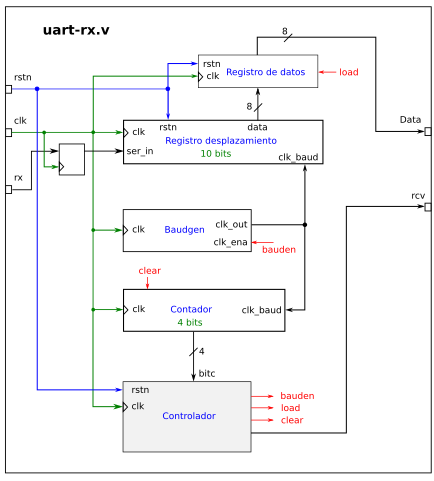
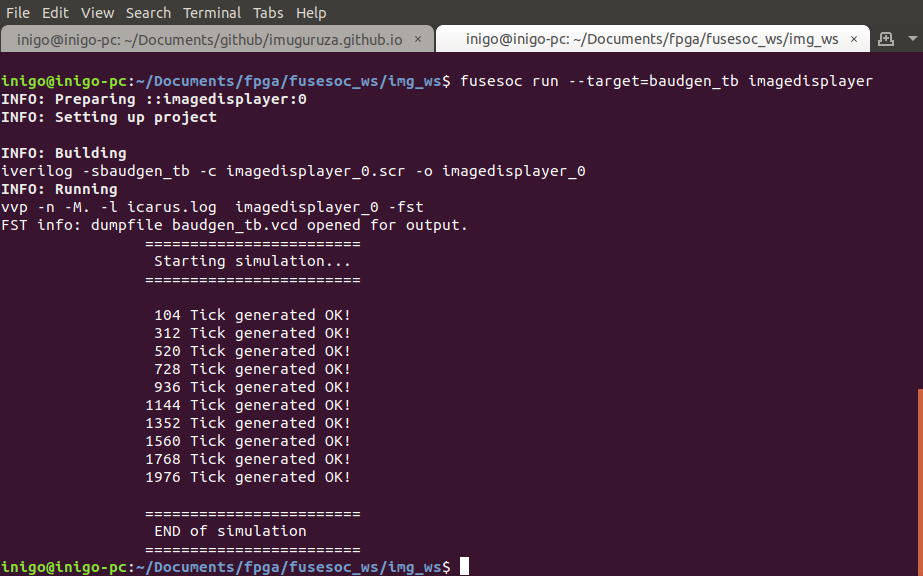

# Improving image displaying design

This time, I have come back to the previous work I did with VGA.
As I mentioned in the [post](vga.md) I wrote, I wanted to upgrade the design to
be more useful.

This time, I have added an image receiving functionality to the design. This allows
you to send hexadecimal image files to the board using serial communication.
Once the the file is sent, the new image is displayed. Let's see what I have added
to the previous design and discuss some technical details.

But first, check the next video to see how it works:
[](https://www.youtube.com/watch?v=W6Zqx2kKLz8&feature=youtu.be)

You can find the design in a separated [repository](https://github.com/imuguruza/image_displayer),
as I decided to use FuseSoC as build system, replacing the `Makefile`s I was using.

The first block I have added is a serial communication read module. This module reads the
`rx` line and provides the received 8-bit data at its output, using a `data ready`
signal pulse to signal it. I have reused the FPGAwars [uart-rx](https://github.com/Obijuan/open-fpga-verilog-tutorial/wiki/Cap%C3%ADtulo-25%3A-Unidad-de-recepci%C3%B3n-serie-as%C3%ADncrona)
for that purpose.

This module contains a state machine that waits till `rx` goes low, and stores the
received bits. You can configure the baud rate of the communications, to fit your
needs.



*functional blocks of UART RX module, taken frome [here](https://github.com/Obijuan/open-fpga-verilog-tutorial/wiki/Cap%C3%ADtulo-25%3A-Unidad-de-recepci%C3%B3n-serie-as%C3%ADncrona)*

Thanks to this module, the FPGA will be able to read the new image file sent from
the computer, but still we need to store the image in RAM and display it. For such
a purpose, I have decided to create small state machine that controls if the FPGA
reads the serial or displays the image.


*UART RX cronogram taken frome [here](https://github.com/Obijuan/open-fpga-verilog-tutorial/wiki/Cap%C3%ADtulo-25%3A-Unidad-de-recepci%C3%B3n-serie-as%C3%ADncrona)*

As the embedded RAM in the iCE40H4XK allows me to create just an 8-bit 100x100 pixel image,
I have decided to keep it. I could add a FIFO, splitting the RAM, to store the new
image but this would mean to sacrifice the size (or the color palette) of the image.

I decided to use the read and write capabilities of the RAM. To control it, I used
a two-state state machine. This allows to avoid simultaneous read and writes from the RAM.

By default, the state machine is in display mode, reading the stored image in the
RAM and displaying it through VGA.

Once the `rx` generates the start bit, the state machine
changes to write state. In this state, the `uart rx` provides the data.
This new data is stored in the RAM, using the `data ready` pulse to detect
when a new chunk has arrived.

As the new image is still not available, meanwhile, the image generator creates
a light blue color in the screen.

Once the new image is received, the state machine goes back to display mode,
putting the RAM into read mode and displaying the image again.

## Practicing crossing domain clock

The default clock of the design is of 25MHz. This is created by the PLL of the
board I am using. This is required to meet the VGA timings. But the serial
communication does not need such a fast clock.

As I have been reading about crossing domain clock, I decided to put it in practice.
Before talking about this topic, I want to explain a bit which are the design's clock
domains. If we divide it into functional blocks, it would look like the
next diagram:


The UART RX module uses the board's 12MHz clock and the rest of the design works under
25MHz. This implies that some signals in the design work at different speed and
this needs to be treated carefully.

The `data ready` is under 12MHz domain and it is read by the part that is responsible
of writing the new data in RAM, which works at 25MHz. To avoid [metastability](https://en.wikipedia.org/wiki/Metastability_(electronics)),
the signal `data ready` is registered using some flip-flops, like this:

```
always @(posedge clk_sys) begin
	data_rdy_rx       <= data_rdy;
	data_rdy_ram_prev <= data_rdy_rx;
  data_rdy_ram      <= data_rdy_ram_prev;
  data_rdy_new      <= data_rdy_ram;
```

As we can see, this `always` block is executed each time `clk_sys` positive edge
occurs. This clock is the 25MHz clock. This registers also allows to check a
positive edge of the signal later in the design:

```
if (data_rdy_new == 1 && data_rdy_ram == 0 ) //Posedge happened, new data
```

This way, any conflict that could arise is avoided. In addition, as the serial
read line could change asynchronously, I have used the same method to avoid problems.
This signal is also registered in the same `always block`:

```
rx_reg_prev_3 <= rx;
rx_reg_prev_2 <= rx_reg_prev_3;
rx_reg_prev   <= rx_reg_prev_2;
rx_reg        <= rx_reg_prev;
```

And the registers are used to decide when the state machine needs to change to write mode:

```
if (rx_reg_prev == 0 && rx_reg == 1 && write_addr == 0) //RX Start condition
```

This is making the design a bit more complicated, but I think it worth the effort.

If you want to understand better crossing clock domain topic, please check the next links:

- [Nandland video](https://www.youtube.com/watch?v=eyNU6mn_-7g)
- [fpga4fun](https://www.fpga4fun.com/CrossClockDomain.html)

## Sending new images

In order to send new images, I have created a python script that sends
through serial a selected image. I have added three of them: Futurama's
Bender, Fry and Zapp Brannigan's image. This is the result:


To use the script properly, you need to specify the serial port in which the board
is attached and the image you want to load:

```
$ cd image_displayer/sw
$ python3 serial_img_send.py /dev/ttyUSB1 ../data/bender.mem
```

## Using FuseSoC as package manager

This time, I have decided to create a FuseSoC core of the design. This has allowed
me to forget about creating a `Makefile` to add the test benches simulation and
the synthesis of the module.


*baudgen module test bench execution using FuseSoC*

It has been also easier to add parameters, for example, the baud rate of the serial
communication or the default board clock value. This parameters are passed from the
core file to the Verilog files, easing the parametrization of the design.

It seems straightforward to add different FuseSoC cores to your own (complex) design.
As parameters are easy to handle too, now I understand better the potential of using
such a package manager/compiling tool in designs.

## TODOs

As I have used already the image generator twice, I think it would be a good idea
to wrap it around a module and may be offer it as a FuseSoC core, to ease the reuse
of it.

In addition to this, the python script could be improved to support more image files,
because the creation process is the same as before, and it is not as easy as it should.

## Resources

- [Github repo](https://github.com/imuguruza/image_displayer)
